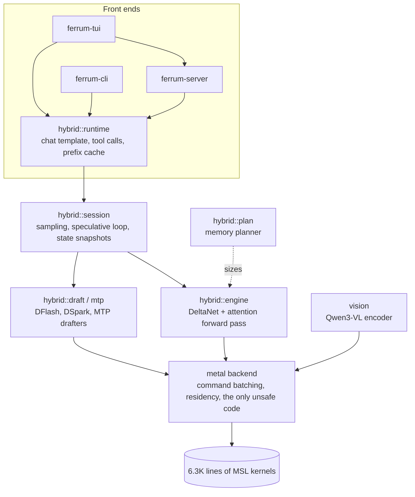

# Ferrum

[](https://github.com/austinwells-dev/ferrum/actions/workflows/ci.yml)


[](#license)


**A from-scratch LLM inference engine for Apple Silicon, written in Rust with hand-written Metal kernels.**

Ferrum runs 27B–35B language models on a 32 GB Mac, faster than llama.cpp on the same GGUF files. It has no runtime dependency on MLX, llama.cpp, PyTorch, Python or Apple's MPS. Every kernel, from the quantized matrix multiplies to Gated DeltaNet linear attention and speculative-decoding verification, is its own Metal Shading Language code, driven from safe Rust.

You give it a model file and then either chat in the terminal, use the full-screen TUI (chat, a sandboxed coding agent, and a benchmarking tool), or run a local server that speaks the **OpenAI** and **Anthropic** APIs, so existing clients and coding agents work with it unchanged.

## Highlights

- **Faster than llama.cpp on the same files.** Measured on an M5: 15% faster prefill and 11% faster decode on a dense 27B model, 8–18% faster on a 35B mixture-of-experts. [Numbers below](#performance).
- **Lossless speculative decoding, up to 2.5× faster.** Supports MTP heads, DFlash/DFlash2 and DSpark drafters. Greedy output is identical with and without speculation. On the dense 27B, Ferrum checks 8–16 drafted tokens for about 1.5× the cost of one token, where llama.cpp pays 2.4–3.8×.
- **Plans memory before loading weights.** Every buffer is predicted from GGUF metadata, and Ferrum picks the largest context that fits: 101K tokens for the 27B model, the full 262K for the 35B MoE. Predictions match Metal's own accounting to within a few MiB.
- **Matches llama.cpp's output.** Mean KL divergence against llama.cpp's own logits is 4×10⁻⁶ on the 27B model.
- **Drop-in server.** OpenAI `/v1/chat/completions`, Anthropic `/v1/messages`, tool calls, reasoning controls, image input, and conversation caching that only processes the new suffix of each request.
- **Coding agent in a sandbox.** The TUI's agent can edit a project, run commands and fetch pages inside a macOS Seatbelt profile that can only write to that project.

## Install

**You need** an Apple Silicon Mac, the [Rust toolchain](https://rustup.rs) (1.96 or newer) and Apple's Command Line Tools (`xcode-select --install`). Xcode is not required, because shaders are compiled at runtime.

```sh
git clone https://github.com/austinwells-dev/ferrum.git
cd ferrum
cargo install --path .
```

This builds an optimized release and puts four binaries on your `PATH` (in `~/.cargo/bin`):

| Binary | What it is |
|---|---|
| `ferrum-tui` | Full-screen launcher: chat, coding agent, server and benchmarks |
| `ferrum-cli` | Plain terminal chat |
| `ferrum-server` | OpenAI- and Anthropic-compatible HTTP server |
| `ferrum` | Developer tool: device info, smoke tests, small-model runner |

If you'd rather not install, `cargo build --release` puts the same binaries in `target/release/`.

## Get a model

Ferrum never downloads anything, so you provide the model files. The main engine (used by `ferrum-cli`, `ferrum-server` and the TUI) runs **Qwen3.5-family GGUF** models. These two are validated end to end on a 32 GB Mac:

| Model | Hugging Face repo | File | Size |
|---|---|---|---|
| Swift 1.5 (Qwen3.8-27B, dense) | [`ukisai/Swift-1.5-Qwen3.8-27B-GGUF`](https://huggingface.co/ukisai/Swift-1.5-Qwen3.8-27B-GGUF) | `Swift-1.5-Qwen3.8-27B-Q4_K_M.gguf` | 17.4 GB |
| Tiel-Coder 35B-A3B (MoE, 3B active) | [`peculiar-ragdoll/Tiel-Coder-35B-A3B-GGUF-MTP`](https://huggingface.co/peculiar-ragdoll/Tiel-Coder-35B-A3B-GGUF-MTP) | `Tiel-Coder-35B-A3B-MTP-UD-IQ4_XS.gguf` | 18.1 GB |

```sh
# Needs the Hugging Face CLI (pip install -U huggingface_hub)
hf download peculiar-ragdoll/Tiel-Coder-35B-A3B-GGUF-MTP \
  Tiel-Coder-35B-A3B-MTP-UD-IQ4_XS.gguf --local-dir ~/models
```

The MoE model is the better place to start because it decodes at about 40 tok/s. The TUI finds models on its own in `~/models`, `~/Downloads`, the Hugging Face cache and LM Studio's folder, and greys out any file Ferrum can't run, with the reason.

## Quick start

```sh
# Full-screen launcher (try: alias ferrum=ferrum-tui)
ferrum-tui

# Chat in the terminal
ferrum-cli --model ~/models/Tiel-Coder-35B-A3B-MTP-UD-IQ4_XS.gguf

# Serve at http://127.0.0.1:8080/v1
ferrum-server --model ~/models/Tiel-Coder-35B-A3B-MTP-UD-IQ4_XS.gguf
```

Once the server is running, any OpenAI or Anthropic client can talk to it:

```sh
curl http://127.0.0.1:8080/v1/chat/completions \
  -H 'Content-Type: application/json' \
  -d '{"messages": [{"role": "user", "content": "Write a haiku about Rust."}]}'
```

To make generation faster, add a drafter: `--draft mtp` uses the prediction head inside the GGUF and needs no extra download. See [speculative decoding](docs/server.md#speculative-decoding).

## The TUI

`ferrum-tui` opens on a home screen with five sections:

- **Chat.** Streaming markdown, a separate reasoning view, file and image attachments, and optional agent tools.
- **Agents.** A local coding agent that works in a project folder. It can read, grep, edit, run commands and checks, and keep a plan, all inside a Seatbelt sandbox and with an approval mode you choose.
- **Serve.** Starts `ferrum-server` and shows its endpoint, health and live log.
- **Benchmark.** Finds the fastest drafter and draft depth for a model on *your* Mac. It checks that every candidate's output matches plain decoding and saves the winner as a favorite.
- **Settings.** Model folders, favorites and startup options.

Setups (model, sampling, drafter) are saved as favorites. The [TUI guide](docs/tui.md) covers the agent tools, the sandbox, context management and the benchmark in detail.

## Performance

These are measured on a 32 GB Apple M5, with Ferrum and llama.cpp running the same GGUF file. Units are tokens per second (higher is better): **pp** is prompt processing (prefill) and **tg** is text generation (decode).

| Benchmark (tok/s) | Ferrum | llama.cpp |
|---|---|---|
| Swift 27B pp512 / pp8192 | **171.9 / 162.1** | 149.8 / 134.4 |
| Swift 27B tg at empty / 32K context | **6.65 / 5.85** | 5.98 / 5.47 |
| Tiel 35B-A3B pp512 / pp16384 | **867 / 623** | 803 / 559 |
| Tiel 35B-A3B tg at empty / 32K context | **42.1 / 29.5** | 35.8 / 26.8 |

**With speculative decoding** (8 chat prompts × 128 tokens, greedy, llama.cpp at commit 9710a32):

| Setup (tok/s) | Ferrum | llama.cpp |
|---|---|---|
| Swift, no speculation | 7.11 | 6.74 |
| Swift + MTP (3 drafts) | 12.60 | 11.17 |
| Swift + `z-lab/Qwen3.8-27B-DFlash2` | **17.78** | 9.87 |
| Swift + `RedHatAI/Qwen3.8-27B-speculator.dspark` | 16.37 | 6.83 |
| Tiel, no speculation | 41.29 | 41.14 |
| Tiel + `jzinno/Ornith-1.5-35B-A3B-DFlash2` (2 drafts) | **57.12** | 50.61 |

Both engines accept the same share of drafts, so Ferrum's lead comes from cheaper verification. Accuracy is measured as KL divergence over llama-perplexity's text chunks: on Swift, Ferrum matches llama.cpp to a mean KLD of 4×10⁻⁶; on Tiel, both are equally close to a high-precision reference (0.0106 for Ferrum vs 0.0107 for llama.cpp). Small models (under 1B) still run at 0.6–1.0× llama.cpp's speed, because fixed per-kernel overhead dominates at that size. Full methodology and raw logs are in the [engineering journals](docs/README.md).

## How it works



Some of the engineering choices:

- **Quantized weights stay in their GGML block format** and are read straight into Metal buffers. Decode uses GEMV kernels tuned per quant type; prefill dequantizes tiles to F16 and runs on the M5's TensorOps matrix units with F32 accumulation.
- **Nothing allocates after load.** KV cache, recurrent DeltaNet state and all scratch are sized by the planner once. Prefill is chunked with flash-style attention, so no activation grows with the square of the sequence length.
- **Conversation caching for hybrid models.** Linear-attention state can't be rewound like a KV cache, so the session keeps recurrent-state snapshots. A request that extends the previous conversation only processes the new tokens.
- **Speculative verification is cheap.** Batched GEMV handles 2–3 rows and a narrow 16×64 TensorOps tile handles 4–32 rows. A 16-token verify on the 27B used to cost 3.5× a single-token step and now costs 1.4×.
- **Safety boundary.** The library is `#![deny(unsafe_code)]` everywhere except the Metal backend, where six small, documented `unsafe` blocks do FFI and shared-memory mapping. Tensors are immutable once published, and command completion is checked before any result is readable.

The design is covered in [docs/architecture.md](docs/architecture.md). How it was built, including the experiments that failed, is in the [phase journals](docs/README.md#engineering-journals).

## Other supported models

The developer binary `ferrum run` has a second, general transformer engine that runs smaller checkpoints. Each was validated against reference logits:

| Family | Validated checkpoints |
|---|---|
| Qwen2.5 | 0.5B-Instruct (BF16, Q4_K_M GGUF) |
| Qwen3 | 0.6B and 1.7B (BF16), 0.6B Q8_0 GGUF |
| IBM Granite 4 / Granite MoE | 4.0 350M, 3.1 1B-A400M (BF16) |
| AllenAI OLMo 2 | 0425 1B (F32) |
| LiquidAI LFM2.5 | 230M (BF16), 8B-A1B hybrid MoE (BF16, Q4_K_M GGUF) |

```sh
ferrum run --model ~/.cache/huggingface/hub/models--Qwen--Qwen3-0.6B/snapshots/<rev> \
  --prompt 'Hello!' --max-new-tokens 32 --temperature 0
```

Weight formats: safetensors (F32/F16/BF16), GGUF Q4/Q5/Q6/Q8 including K-quants and IQ4_XS/IQ3_S, and MLX affine Q4.

## Documentation

| Guide | Contents |
|---|---|
| [Server](docs/server.md) | Endpoints, thinking controls, caching, streaming, vision, speculative decoding, flags |
| [TUI](docs/tui.md) | Chat, the coding agent and its sandbox, context optimisers, the benchmark tab |
| [Development](docs/development.md) | Building, testing (including Metal validation layers), profiling, using Ferrum as a library |
| [Architecture](docs/architecture.md) | Tensor and storage model, Metal backend, safety argument, the hybrid engine |
| [Vision](docs/vision.md) | How image input is encoded and positioned |
| [Journals](docs/README.md) | Phase-by-phase engineering log with measurements |

## Limitations

- Apple Silicon only. Everything was developed and measured on an M5; older chips should work but haven't been validated, and `ferrum info` reports what your GPU supports.
- One request at a time (batch size 1).
- The server and TUI run Qwen3.5-family hybrids only. Other architectures go through the developer runner.
- Vision supports the Qwen3-VL projector only (no video).
- No training and no language bindings.

## License

Dual-licensed under either [MIT](LICENSE-MIT) or [Apache-2.0](LICENSE-APACHE), at your option. Model weights are not included and keep their own licenses.
